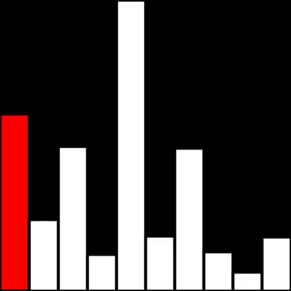
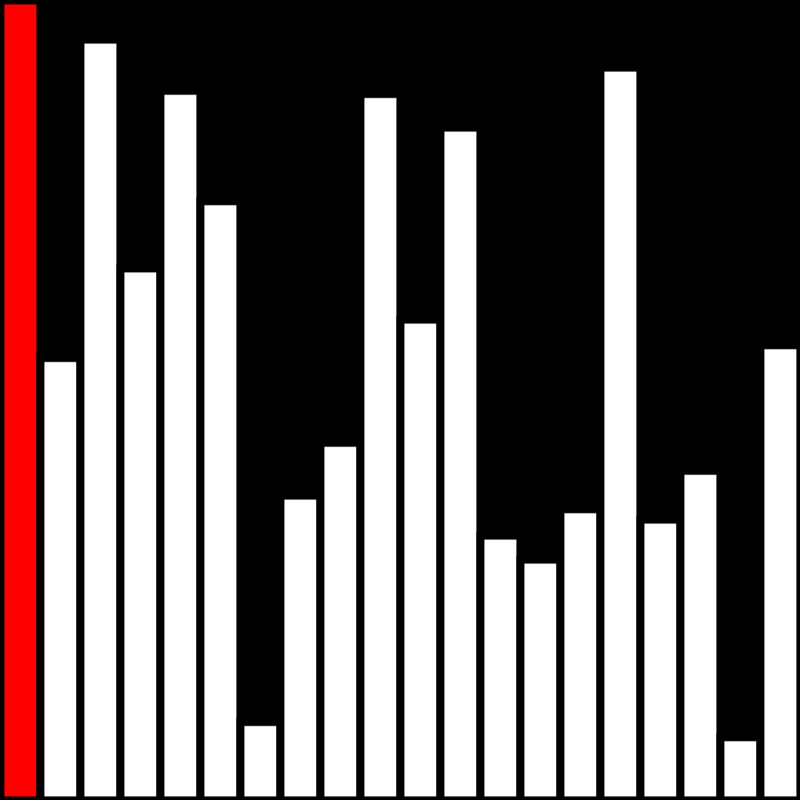
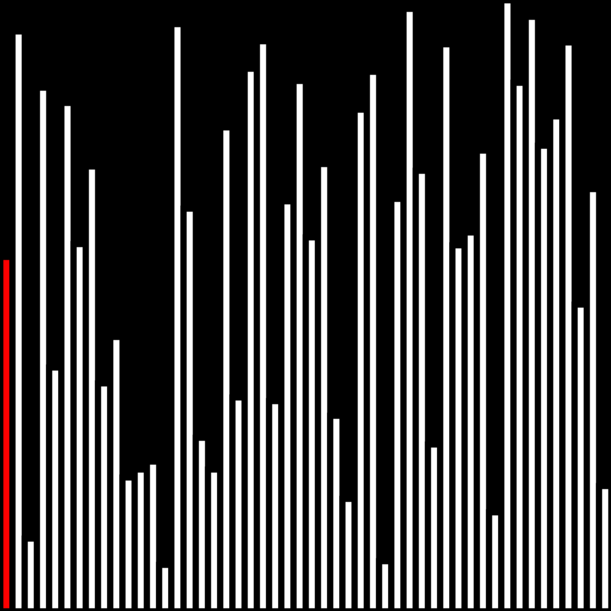

# Bubble Sort Visualizer


## Overview
This program is a visual demonstration of bubble sort, a very basic O(n^2) sorting algorithm. The program first populates an array with randomly sized bars that span the width of the window. Then, it uses the bubble sort algorithm to sort them by height from shortest (left) to tallest (right), making one comparison per loop.

The purpose of this project was to become more conversant in the Processing language and gain a deeper understanding of bubble sort by coding my own version of the typical sorting visualization from scratch.


## Demonstration


<p>  &nbsp;&nbsp;&nbsp;&nbsp;&nbsp;&nbsp;&nbsp;&nbsp;
	&nbsp;&nbsp;&nbsp;&nbsp;<b>Small Dataset - 10 Elements</b><br><i>Short and sweet</i><br><br></p>
	
<p>  &nbsp;&nbsp;&nbsp;&nbsp;&nbsp;&nbsp;&nbsp;&nbsp;
	&nbsp;&nbsp;&nbsp;&nbsp;<b>Medium Dataset - 20 Elements</b><br><i>Slow and steady wins the race?</i><br><br></p>

<p>  &nbsp;&nbsp;&nbsp;&nbsp;&nbsp;&nbsp;&nbsp;&nbsp;
	&nbsp;&nbsp;&nbsp;&nbsp;<b>Large Dataset - 50 Elements</b><br><i>As fast as a cheetah</i><br><br></p>


## Installation

1. Download [Processing 3](https://processing.org/download/).

2. Download and unzip [sort_visualizer.pde](https://github.com/neha-deshpande001/bubble_sort_visualizer/archive/master.zip).

3. Run sort_visualizer.pde with Processing 3.

4. On line 4, change "10" to the number of elements you want the program to sort. More elements implies that the sorting process will take more time.

```
  int numElements = 10;
```

5. Click the triangle "play" button on the top left of the Processing window to run the program.
